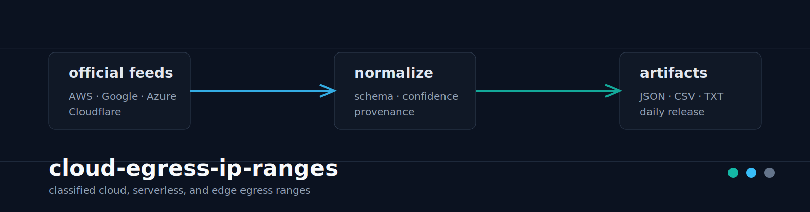

<p align="center">
  
</p>

<h1 align="center">cloud-egress-ip-ranges</h1>

<p align="center">
  Classified cloud, serverless, and edge egress IP ranges generated from official provider feeds.
</p>

<p align="center">
  <a href="https://github.com/ipanalytics/cloud-egress-ip-ranges/actions/workflows/ci.yml"></a>
  <a href="https://github.com/ipanalytics/cloud-egress-ip-ranges/actions/workflows/daily-release.yml"></a>
  <a href="https://github.com/ipanalytics/cloud-egress-ip-ranges/releases/tag/daily"></a>
  
  
  
</p>

`cloud-egress-ip-ranges` builds a normalized, classified dataset of cloud and edge network ranges for security engineering, traffic analysis, fraud controls, WAF policy, and data pipelines. It consumes official provider feeds, preserves source provenance, assigns an explicit confidence model, and publishes both machine-readable records and operationally convenient CIDR lists.

---

## Overview

Modern abuse and automation traffic often originates from disposable cloud infrastructure, managed compute, edge networks, CI systems, and serverless platforms. Provider-owned IP space is easy to identify at a broad level; exact workload attribution is not.

This project keeps that distinction explicit. It answers questions like:

- Which provider owns or publishes this CIDR?
- Is this cloud customer address space, an edge network, or a broad provider range?
- Could serverless or managed compute plausibly egress from this range?
- What action is reasonable for risk tooling: allow, monitor, rate limit, or challenge?
- Which source and precision level produced the classification?

The output is designed for systems that need deterministic data files, not a hosted dependency.

## Architecture

```text
official feeds / fixtures
        |
        v
provider parsers
  AWS, Google, Azure, Oracle, Cloudflare,
  Fastly, GitHub, GitLab, Atlassian, Stripe
        |
        v
normalized records
  schema + confidence + provenance
        |
        v
artifact builder
  JSON, CSV, manifest, classified lists
        |
        v
daily GitHub release assets
```

The builder has two execution modes:

| Mode | Purpose | Sources |
|---|---|---|
| Offline fixtures | CI, deterministic tests, local development | `tests/fixtures/` |
| Live build | Daily release artifacts | AWS, Google, Azure, Oracle, Cloudflare, Fastly, GitHub, GitLab, Atlassian, and Stripe official feeds/docs |

## Live Source Inventory

The release workflow generates `sources.md` on every build and uses it as the GitHub release body. The same inventory is also embedded in `manifest.json` under `source_catalog`.

| Provider | Feed | Source ID | Classification |
|---|---|---|---|
| AWS | AWS `ip-ranges.json` | `aws_ip_ranges_json` | cloud and AWS service ranges |
| Google Cloud | Google Cloud `cloud.json` | `google_cloud_json` | customer external IP ranges |
| Google | Google `goog.json` | `google_goog_json` | Google-owned provider ranges |
| Azure | Azure Public Service Tags JSON | `azure_service_tags_public_json` | service-tag and regional ranges |
| Oracle Cloud | Oracle OCI public IP ranges | `oracle_public_ip_ranges_json` | regional public cloud ranges |
| Cloudflare | Cloudflare IPv4 ranges | `cloudflare_ips_v4` | edge network ranges |
| Cloudflare | Cloudflare IPv6 ranges | `cloudflare_ips_v6` | edge network ranges |
| Fastly | Fastly public IP list | `fastly_public_ip_list` | edge/CDN and Compute possible ranges |
| GitHub | GitHub Meta API | `github_meta_api` | Actions, hooks, pages, API, git, and web ranges |
| GitLab | GitLab.com IP range docs | `gitlab_com_docs` | Web/API and webhook source ranges |
| Atlassian | Atlassian Cloud IP ranges | `atlassian_ip_ranges_json` | Atlassian Cloud egress ranges |
| Stripe | Stripe webhook IPs | `stripe_webhook_ips_json` | webhook source IPs |
| Stripe | Stripe API IPs | `stripe_api_ips_json` | API source IPs |

`provider-catalog.md` is generated beside the feed. It tracks all modeled provider tiers, including providers that are cataloged for ASN/BGP, docs scraping, customer-specific egress, or capability-only handling but are not emitted as CIDRs until a defensible source is implemented.

## Features

- Official feed ingestion for AWS, Google, Azure, Oracle, Cloudflare, Fastly, GitHub, GitLab, Atlassian, and Stripe.
- Conservative classification model with `L0` through `L5` precision levels.
- Explicit `confidence`, `false_positive_risk`, and `recommended_action` fields.
- Deterministic offline builds for repeatable CI and tests.
- Root JSON and CSV datasets for analytics pipelines.
- JSONL, Parquet, SQLite, and DuckDB artifacts for data engineering workflows.
- Classified JSON and TXT lists grouped by provider, platform family, service hint, precision level, and recommended action.
- NGINX, Cloudflare, Splunk, Elastic, and ClickHouse integration outputs.
- Public `providers.yaml` registry and `egress-capabilities.json` capability matrix.
- `latest.json` and `diff/latest.json` for release monitoring.
- CLI lookup and explanation commands for local investigation.
- Daily GitHub Actions release workflow with stable asset names and GitHub Pages dashboard.
- No hosted API or runtime service requirement.

## Quick Start

```bash
git clone https://github.com/ipanalytics/cloud-egress-ip-ranges.git
cd cloud-egress-ip-ranges

uv run --python 3.12 python -m cloud_egress_ip_ranges build --offline-fixtures
uv run --python 3.12 python -m cloud_egress_ip_ranges lookup 1.1.1.1
uv run --python 3.12 python -m cloud_egress_ip_ranges explain 1.1.1.1
```

## Installation

The repository is a standard Python 3.12 project.

```bash
uv run --python 3.12 python -m cloud_egress_ip_ranges --help
```

For editable development:

```bash
uv sync --python 3.12
uv run python -m unittest discover -s tests
```

No runtime service, database, queue, or external Python package is required by the core implementation.

## Usage

### Build Artifacts From Fixtures

```bash
uv run --python 3.12 python scripts/build.py --offline-fixtures
```

Writes:

```text
dist/cloud-egress-ip-ranges.json
dist/cloud-egress-ip-ranges.csv
dist/manifest.json
dist/classified/
```

### Lookup An IP

```bash
uv run --python 3.12 python -m cloud_egress_ip_ranges lookup 1.1.1.1
```

```json
{
  "ip": "1.1.1.1",
  "matches": [
    {
      "cidr": "1.1.1.0/24",
      "provider": "cloudflare",
      "platform_family": "edge_network",
      "service_hint": "cloudflare_edge",
      "confidence": 91,
      "false_positive_risk": 29,
      "recommended_action": "challenge",
      "serverless_possible": true,
      "serverless_exact": false,
      "source": "cloudflare_ips_v4",
      "source_type": "official_feed",
      "precision_level": "L0"
    }
  ]
}
```

### Explain A Match

```bash
uv run --python 3.12 python -m cloud_egress_ip_ranges explain 1.1.1.1
```

```text
1.1.1.1: 1 matching range(s)
- 1.1.1.0/24 provider=cloudflare service=cloudflare_edge confidence=91 false_positive_risk=29 action=challenge; serverless possible, edge possible; exact serverless attribution is not claimed from this source. Source: cloudflare_ips_v4 (official_feed).
```

### Inspect Feed Statistics

```bash
uv run --python 3.12 python -m cloud_egress_ip_ranges sources
uv run --python 3.12 python -m cloud_egress_ip_ranges stats
```

## Outputs And Release Assets

Daily release assets are published on the [`daily`](https://github.com/ipanalytics/cloud-egress-ip-ranges/releases/tag/daily) tag.

| Asset | Description |
|---|---|
| `cloud-egress-ip-ranges.json` | Canonical JSON feed with schema version, generation timestamp, and records |
| `cloud-egress-ip-ranges.csv` | Flat tabular export |
| `cloud-egress-ip-ranges.jsonl` | One JSON record per line for streaming ingestion |
| `cloud-egress-ip-ranges.parquet` | Columnar export for warehouse and lakehouse pipelines |
| `cloud-egress-ip-ranges.sqlite` | SQLite database with indexed `egress_ranges` table |
| `cloud-egress-ip-ranges.duckdb` | DuckDB database with `egress_ranges` table |
| `manifest.json` | Counts, source inventory, classified inventory, and SHA256 checksums |
| `latest.json` | Compact release summary and artifact pointers |
| `diff-latest.json` | Latest feed diff against the previous daily release when available |
| `sources.md` | Provider/feed inventory used as the release body |
| `providers.yaml` | Public provider registry |
| `egress-capabilities.json` | Provider capability matrix |
| `provider-catalog.json` | Tiered provider catalog with implementation status and collection method |
| `provider-catalog.md` | Human-readable provider coverage report |
| `cloud-egress-ip-ranges-classified.tar.gz` | Classified JSON/TXT lists for direct policy consumption |
| `cloud-egress-ip-ranges-integrations.tar.gz` | NGINX, Cloudflare, Splunk, Elastic, and ClickHouse outputs |

Classified list layout:

```text
classified/provider/<provider>.json
classified/provider/<provider>.txt
classified/platform_family/<family>.json
classified/platform_family/<family>.txt
classified/service_hint/<service>.json
classified/service_hint/<service>.txt
classified/precision_level/<level>.json
classified/precision_level/<level>.txt
classified/recommended_action/<action>.json
classified/recommended_action/<action>.txt
```

TXT files contain one CIDR per line. JSON files include classification metadata and full records.

## Data Format

Each range record contains a CIDR, classification, confidence, provenance, and operational recommendation.

| Field | Meaning |
|---|---|
| `cidr` | IPv4 or IPv6 CIDR |
| `provider` | Normalized provider slug |
| `platform_family` | `cloud`, `edge_network`, `provider_network`, or related family |
| `service_hint` | Provider service tag or project-level service hint |
| `serverless_possible` | Serverless or managed compute can plausibly use the range |
| `serverless_exact` | Exact serverless attribution; gated to owner/probe-confirmed sources |
| `edge_possible` | Edge/CDN/proxy use is plausible |
| `source` / `source_type` | Feed identifier and provenance class |
| `precision_level` | `L0` through `L5` attribution precision |
| `confidence` | Provider/platform classification confidence, 0-100 |
| `false_positive_risk` | Operational false-positive risk, 0-100 |
| `recommended_action` | `allow`, `monitor`, `rate_limit_or_challenge`, or `challenge` |

See [docs/schema.md](docs/schema.md), [docs/confidence.md](docs/confidence.md), and [docs/outputs.md](docs/outputs.md).

<details>
<summary>Precision levels</summary>

| Level | Meaning |
|---|---|
| `L0` | Exact official service range |
| `L1` | Official provider range |
| `L2` | Serverless or managed compute possible |
| `L3` | Owner-confirmed egress |
| `L4` | Observed probe-confirmed egress |
| `L5` | Weak ASN/RDAP/WHOIS inference |

</details>

## Operational Notes

- Treat `recommended_action` as a policy hint, not a hard block decision.
- Prefer classified TXT lists for WAF, rate-limit, and enrichment pipelines that only need CIDRs.
- Use JSON records when provenance, confidence, and false-positive risk matter.
- Monitor `manifest.json` checksums, source counts, and `provider_catalog_coverage` across releases.
- Keep owner-confirmed ranges separate from broad official provider feeds.
- For live local builds, pass the current Azure Service Tags JSON URL:

```bash
uv run --python 3.12 python scripts/build.py --azure-service-tags-url "$AZURE_SERVICE_TAGS_URL"
```

## Project Scope

The project maintains a reproducible IP intelligence dataset and local tooling around that dataset. It does not require a daemon, database, web service, or account-level cloud telemetry. Public provider feeds are treated as provider/platform evidence; exact workload attribution requires owner-confirmed or observed data.

## Use Cases

- WAF and bot mitigation enrichment.
- Fraud and signup risk scoring.
- API abuse and scraping analysis.
- SIEM, warehouse, and log pipeline enrichment.
- Cloud/edge traffic segmentation.
- Research datasets for disposable compute and managed egress behavior.

## Limitations

Public cloud IP feeds do not identify the customer workload behind a request. NAT, BYOIP, proxying, private connectivity, and platform-specific egress configuration can change what appears on the wire. The dataset is best used as one signal in a broader risk model.

## Directory Structure

```text
.
├── .github/workflows/
│   ├── ci.yml
│   └── daily-release.yml
├── docs/
│   ├── confidence.md
│   ├── operations.md
│   ├── outputs.md
│   ├── schema.md
│   └── sources.md
├── scripts/
│   ├── build.py
│   └── lint.py
├── site/
│   ├── index.html
│   ├── app.js
│   └── style.css
├── src/cloud_egress_ip_ranges/
│   ├── builder.py
│   ├── cli.py
│   ├── confidence.py
│   ├── feed.py
│   ├── lookup.py
│   ├── models.py
│   ├── provider_catalog.py
│   └── sources/
├── tests/
│   └── fixtures/
├── providers.yaml
└── dist/
```

## Deployment

GitHub Actions is the deployment target for the dataset.

| Workflow | Trigger | Purpose |
|---|---|---|
| `ci.yml` | push, pull request | Compile, test, lint, offline build |
| `daily-release.yml` | daily cron, manual dispatch | Live build, release asset publication, Pages dashboard deploy |

The daily workflow resolves the current Azure Service Tags JSON URL, builds live artifacts, packages classified lists, and publishes stable release assets using the repository `GITHUB_TOKEN` with `contents: write`.

## Development

```bash
uv run --python 3.12 python -m compileall src tests scripts
uv run --python 3.12 python -m unittest discover -s tests
uv run --python 3.12 python scripts/lint.py
uv run --python 3.12 python scripts/build.py --offline-fixtures
```

## License

MIT. See [LICENSE](LICENSE).

## Disclaimer

This dataset is for infrastructure, security, analytics, and research workflows. Validate enforcement decisions against your own traffic, tolerance for false positives, and applicable operational requirements.
